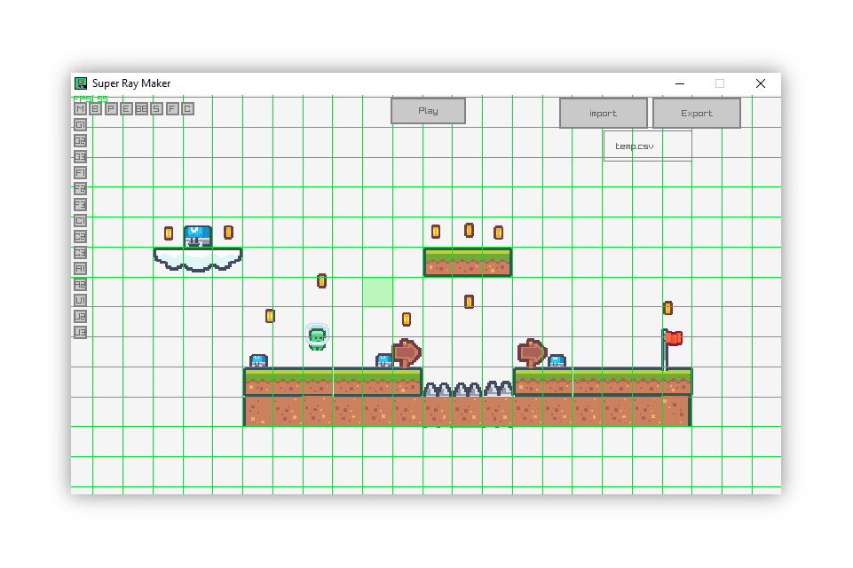

<!-- PROJECT LOGO -->
<h1 align="center">
  <br>
  <a href="https://github.com/BotRandomness/SuperRayMaker"></a>
  <br>
  <b>Super Ray Maker</b>
  <br>
  <sub><sup><b>About
Super Ray Maker, a Mario Maker clone, made using Java and Raylib.</b></sup></sub>
  <br>

</h1>

<p align="center">
       Super Ray Maker (SRM), is a open source Mario Maker clone! <strong>Build levels</strong>, and <strong>share them to your friends</strong>.</br></br>
  For developers, this was made using pure Java, and the Raylib-J library. Raylib is amazing C library mabe by Raysan5, that focuses coding games with fancy overhead or visual editor, <em>"Just coding in the most pure spartan-programmers way"</em>. With Raylib being so flexible, it allows for many bindings to be made for other programming languages, in this case, I used the Raylib-J handmade binding made by CreedVI. Since the editor is a full suite that allows you build levels, and it's written pure Java, editor aspect <strong>theoretically can be intergated to any Raylib project</strong>, using <strong>ANY programming languages</strong>. Thus making it easier for anyone to build a platformer game using SRM as a tool! :)  <br />

</p>

<a href="https://github.com/BotRandomness/SuperRayMaker">
    
</a>

</div>

<!-- ABOUT THE PROJECT -->

## Getting Started
Waaah Hooo! Let's a Go!

### Download
1. Download the Zip file [here](https://github.com/BotRandomness/SuperRayMaker/releases), for your version of operating system
2. Extract the zip file at your desire location
3. Open the `SuperRayMaker` Application, the application is just a single file, no installation, it just opens up!

That's it! Your ready to get building levels!

### Controls
- In the editor, click down the mouse wheel and move the mouse to pan the camera
- In the editor, scroll the mouse wheel to zoom in and out
- Press [SHIFT] key to snap cursor to grid
- Left click to place blocks, Right click to delete blocks
- Buttons in editor to switch blocks
- Hold down control, and left click to go crazy!

### Screenshots
<a href="https://github.com/BotRandomness/SuperRayMaker">
    
</a>
<a href="https://github.com/BotRandomness/SuperRayMaker">
    
</a>
<a href="https://github.com/BotRandomness/SuperRayMaker">
    
</a>

## Compile

Want to tinker around, modify, possibly integrate in your own project, or contribute? Here's how you can get started with the code and compile.

1. this repository through zip, or git.
2. Have or download a java IDE like Intellij IDEA or Eclipse (Intellij IDEA is recommended): https://www.jetbrains.com/idea/download
3. Open/import the project in the IDE
4. That's it! Your ready to get coding! 

### Program Architechture

Heres a little bit on the program layout! </br>

Java is very much a object oriented programming language. With this in mind, everything is object, so the player is object, a block is object, even the menu is whole object itself. With this in mind, each java file is class, which represent the object. 

With this in mind, Heres an example of this works: </br>

`Main.java` is the main file where the program can excute from. The `Main.java` has something we call the main game loop. The main game loop essential is a while loop, that will loop every frame, until the game is closed. Any code in the main game loop should be all code that relates to the game's functions. In this case, the main game loop is spilt between two sections, the `update` and the `render`. As the names suggest, update refers to any code that handles background game logic, while the render refers to any code that is responsible to "draw" the graphics to the screen. In this `Main.java`, objects for "screens" (When I refer to "screens", that just means each "scene" or each "part" of the game) are created. Then in the game main game loop, the "screens" would have methods such as `update()` and `render()`, which then these methods are easily called in `Main.java`.

For example:
```
...
//creating objects for each "screen"
MainMenu mainMenu = new MainMenu();
...
while (!rlj.core.WindowShouldClose())
{
  // Update
  //----------------------------------------------------------------------------------
   mainMenu.mainMenuUpdate();
  //----------------------------------------------------------------------------------

  // Draw
  //----------------------------------------------------------------------------------
  rlj.core.BeginDrawing();
  mainMenu.mainMenuRender();
  rlj.core.EndDrawing();
}
```

Now for the basic structure for each object. Each object would have contains methods to specific task. For example the `Player.java` has a method called `playerMovement()`, which handles all the input from user to control the player. `Player.java` also has a method called `playerAnimation()`, which "draws" the player, and handles animation states. Just like main game loop, these methods gets funneled into, and would be called in two other methods, in this case this would be `playerUpdate()` and `playerRender()` respectively. We do this for two reason. One, just like the "screens", it makes it easy to create the object, and it easier to get the object working. Two, because it would actually help performance, since where not writing a bunch of code directly into the update and render, but it's down by other methods that are being called into thoses methods.

This sort of flexibility is used through out the program, for each object.

The Raylib library is super simple, as the names of each Raylib methods do what they say. A very simple documentation/cheetsheet for Raylib can be found here: https://www.raylib.com/cheatsheet/cheatsheet.html

Note that the included libaray of Raylib-J is a custom compiled version of Raylib-J based on branch 77fdfeb4c7, and a merge inclusion of Raygui-J. 

## Upcoming Features

- [ ] More Blocks and Enemies!
  - More cool types of block, and diffent types of ememies like a flying ememy or spike enemy
- [ ] More Artstyles!
  - Currently, there only Kenney Pixel Platformer Style, feel free to come up with you own art style, I'm planing to make one of my own art style.  
- Post any feature request in the Issues tab!

## Known issues

- [ ] SPAGHETTI CODE MADNESS
  - There is a structure, but it could be better, this is number 1 to fix currently
- [ ] Delta time physics have to be tweak a little
- If you find any other issues/bugs, post about it on the issues tab
  - Also provide what version your using, and how to reproduce it

## Contributing

This project is open-source under the MIT License, meaning your free to do what ever you want with it, free as a brid. This project is freely available for <strong>anyone to contribute</strong>, Raylib or Java beginner or experts, or someone who is new to it all.

If you plan on contributing, a good place to start is to look at upcoming wanted features, and known issues. If you find a new bug, or have feature ideas of your own, posted first to the Issues tab before hand. </br>

To get started on contributing:

1. Fork or Clone the Project
2. Once you have your own repository (it can be a public repository) to work in, you can get started on what you want to do!
3. Make sure you git Add and git Commit your Changes to your repository
4. Then git push to your repository
5. Open a Pull Request in this repositroy, where your changes will be look at to be approved
6. Once it's approved, it will be in a development branch, soon to be merge to the main branch

## Credits

Cool people :)

- @raysan5, the creator of the orignal Raylib library: https://github.com/raysan5/raylib
- @CreedVI, the creator of of the Raylib-J binding library: https://github.com/CreedVI/Raylib-J
- Kenney, the artist for the pixel platformer style: https://www.kenney.nl/assets/pixel-platformer
- All the open source contributors to the mentioned libraries :) 

<!-- LICENSE -->

## License

Distributed under the MIT License. See `LICENSE.txt` for more information.
